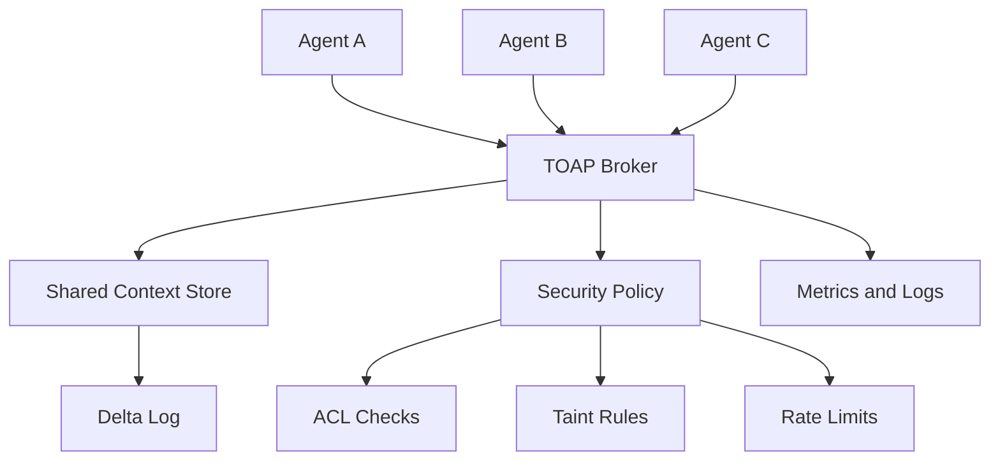

# TOAP

<div align="center">


**Token-Optimized Agent Protocol**

Compact agent-to-agent messages, shared context references, and broker-enforced trust boundaries for multi-agent LLM systems.

[Status](#status) | [Paper](#paper) | [Scope](#scope) | [Architecture](#architecture) | [Protocol](#protocol-direction) | [Docs](#documentation)

</div>

> **Paper:** *TOAP: The Token-Optimized Agent Protocol — A Reference-Minimized, Two-Plane Architecture
> for Inter-Agent Messaging, with an Honest Token Accounting and a Multi-Model Pilot.*
> See [`paper/main.pdf`](paper/main.pdf) (sources in [`paper/`](paper/)). Zenodo DOI: _to be added on release._

## Status

TOAP is at **v1.0 (Rust)**. The stack was rewritten from the original C++ prototype following the
research pass — see the corrected design and evidence in [research.md](research.md).

What works today (**28 tests passing**, plus live multi-process demos and benchmarks):

- `toap-core` — V1 text message model, parser, encoder, **+ V2 binary control-plane codec** (two-plane design).
- `toap-context` — context store + the `Reference` materialization spectrum with graceful fallback,
  **per-context ACL, capability-lattice provenance, TTL+GC, field deltas, cache-coordinate layout**.
- `toap-security` — **token-bucket rate limiter, per-session replay guard, capability/taint policy**.
- `toap-wire` — length-prefixed tokio framing.
- `toap-broker` — tokio TCP server, SYN/ACK sessions, **broker-derived identity**, store ops with ACL,
  **capability-lattice enforcement**, rate-limit, replay rejection, **deltas (`DLT`) + subscriptions (`SUB`→`EVT`)**, routing.
- `toap-client` — async SDK (request/response correlation, inbound + event dispatch, `patch`/`subscribe`).
- `toap-agents` — `agent_a`/`agent_b` (summarizer), `classifier`, and an `orchestrator` (fan-out + merge).
- `toap-mcp` — minimal **MCP server** (JSON-RPC/stdio) exposing the context store as `toap_set`/`toap_get`.
- `benchmark/` — tiktoken token/byte comparisons and the multi-model A/B study behind the paper.

```powershell
cargo build --workspace
cargo test --workspace          # 28 tests pass

# Live fan-out demo (4 terminals): broker, two workers, then the orchestrator
cargo run -p toap-broker
cargo run -p toap-agents --bin agent_b
cargo run -p toap-agents --bin classifier
cargo run -p toap-agents --bin orchestrator

# Benchmarks (Python: pip install -r requirements-dev.txt)
python benchmark/runner.py                       # wire-token comparison vs JSON baseline
python benchmark/ab_study/compute_writer.py      # multi-model A/B study (n=33)
```

**Headline results (honest, reproducible).** In a controlled multi-model study (real Haiku/Sonnet/Opus
generations, deterministic bias-free scoring, n=33), both reference-minimization and a competent
summarizing orchestrator cut downstream tokens at **full accuracy parity**, and — importantly — a
**summarizing baseline (~2.5×) beats TOAP referencing (~1.9×)** on tokens. TOAP therefore earns its
place not through raw token savings but through **losslessness, in-band security, and systematization**
(see the paper). Symbolic opcodes save 50% of *bytes* but only 0–17% of *tokens*. Full caveats in
[docs/claims.md](docs/claims.md).

### Implemented vs. roadmap
Implemented: V1 text + V2 binary planes, context store (ACL/TTL/deltas/subscriptions), capability
lattice, materialization policy with fallback, rate-limit/replay, MCP frontend. Roadmap (needs a model
runtime or external models): the actual **KV-cache tensor transport** (only the policy/trait exists),
**cross-vendor** real-LLM replication, message signing / cross-reconnect replay nonces, Redis/WebSocket
backends.

## Scope

TOAP is a low-level communication layer for multi-agent systems. Its purpose is to reduce repeated coordination overhead by letting agents send compact operations and context IDs instead of repeatedly copying large documents or verbose natural-language instructions.

TOAP focuses on:

| Area | What TOAP Provides |
| --- | --- |
| Message format | Compact, deterministic request and response payloads. |
| Context sharing | Store shared data once, then reference it as `CTX:N`. |
| Routing | Broker-mediated agent-to-agent delivery. |
| Identity | Source identity derived from broker session state. |
| Security | ACL, taint, rate-limit, and strict protocol validation. |
| Measurement | Benchmarks that separate wire bytes, protocol tokens, model input tokens, and latency. |

TOAP does **not** replace MCP, A2A, LangChain, AutoGen, CrewAI, or an LLM runtime. It can sit below or beside those systems as a compact payload and routing protocol.

## Why This Exists

Multi-agent LLM systems often resend the same context through several agents: an orchestrator sends a document to a summarizer, a classifier, a writer, and a reviewer. That increases network bytes, protocol tokens, logs, storage pressure, and security exposure.

TOAP's design goal is simple:

```text
Send the data once. Refer to it many times. Validate every hop.
```

The project is careful about claims: TOAP can reduce wire/message overhead when references replace repeated content. It does not automatically reduce total LLM inference tokens if an agent still fetches a context and places it into a model prompt. Those savings require additional strategies such as retrieval, summarization, caching, or future KV-cache work.

## Architecture



Core components planned across the build phases:

| Component | Role | Status |
| --- | --- | --- |
| `toap-core` | V1 text + V2 binary control-plane codecs, parser, encoder. | **Implemented** |
| `toap-broker` | Sessions, routing, identity, store ops, capability enforcement, deltas, subscriptions. | **Implemented** |
| `toap-context` | Store + `Reference` spectrum/fallback; ACL, capability lattice, TTL+GC, deltas, cache layout. | **Implemented (in-memory)** |
| `toap-client` | Async SDK: requests, events, `patch`, `subscribe`. | **Implemented** |
| `toap-security` | Rate limiter, replay guard, capability/taint policy. | **Implemented** (replay per-session; signing is roadmap) |
| `toap-mcp` | Expose the context store to MCP hosts. | **Implemented (minimal)** |
| Benchmarks | tiktoken wire comparison + multi-model A/B study. | **Implemented** (cross-vendor real-LLM study is roadmap) |
| KV-cache tensor transport | `KvTransport` trait + fallback policy. | **Interface only** (needs a model runtime) |

## Protocol Direction

V1 uses a text frame:

```text
TYPE|MSG_ID|TARGET|PAYLOAD
```

Source identity is **not** trusted from the wire. The broker derives source identity from the accepted session.

Payloads use function-style syntax to avoid ambiguous colon parsing:

```text
SUM(CTX:42)?max_words=150&lang=en
CMP(CTX:11,CTX:22)
SET(CTX:99)?data=hello_world
OK(CTX:87)
PATCH(CTX:42)?field=status&value=approved
```

See [docs/protocol_v1.md](docs/protocol_v1.md) for the current protocol contract.

## Security Model

TOAP treats all peer-agent messages as untrusted. The broker is responsible for identity, routing, ACL checks, taint rules, and rate limits.

Important protocol decisions:

- Agents cannot claim a trusted `SRC` field in V1; identity is broker-derived from the session.
- Trust is broker-policy-derived, not self-declared by agents.
- External/user-originated context carries a **capability-lattice** provenance; the broker refuses
  operations the provenance forbids (e.g. `EXEC`/`PAY`/`DELETE` on user-origin content).
- Normal documents containing SQL, HTML, markdown, code, or prompt-like text are treated as data, not automatically rejected.
- Per-agent token-bucket rate limiting and per-session replay rejection are broker-enforced.
- Numeric performance claims must come from reproducible benchmarks ([docs/claims.md](docs/claims.md)).

See [docs/security_model.md](docs/security_model.md) and [docs/decisions.md](docs/decisions.md).

## Repository Layout

```text
.
+-- Cargo.toml            (Rust workspace)
+-- .cargo/config.toml    (windows-gnu self-contained linking)
+-- crates/
|   +-- toap-core/        (V1 text + V2 binary codecs, parser, encoder)
|   +-- toap-context/     (store: Reference spectrum, ACL, capability lattice, TTL, deltas)
|   +-- toap-security/    (rate limiter, replay guard, taint/capability policy)
|   +-- toap-wire/        (length-prefixed tokio framing)
|   +-- toap-broker/      (TCP server, sessions, routing; lib + bin + e2e tests)
|   +-- toap-client/      (async client SDK)
|   +-- toap-agents/      (agent_a, agent_b, classifier, orchestrator)
|   +-- toap-mcp/         (MCP stdio server over the context store)
+-- benchmark/            (tiktoken comparisons + multi-model A/B study + run records)
+-- paper/                (main.tex/.pdf, figures, METHODS.md)
+-- docs/                 (protocol_v1, security_model, claims, decisions)
+-- research.md, research-cot-synthesis.md   (research pass + reasoning)
```

## Documentation

| Document | Use It For |
| --- | --- |
| [docs/protocol_v1.md](docs/protocol_v1.md) | Exact V1 frame, payload syntax, examples, and validation rules. |
| [docs/security_model.md](docs/security_model.md) | Identity, sessions, trust, ACL, taint, injection handling, logging. |
| [docs/claims.md](docs/claims.md) | Measured claims, targets, non-claims, and publication rules. |
| [docs/decisions.md](docs/decisions.md) | Engineering decisions and rationale. |
| [TEST_PLAN.md](TEST_PLAN.md) | Verification plan for protocol, broker, store, SDK, security, and benchmarks. |

## Development Setup

Requires Rust stable. The repo builds on any platform with a standard toolchain
(`rustup default stable`). On a Windows host without MSVC, use the GNU toolchain:

```powershell
rustup-init.exe -y --default-host x86_64-pc-windows-gnu --profile minimal
rustup component add rust-mingw      # provides self-contained MinGW libs
```

```powershell
cargo build --workspace
cargo test --workspace          # 28 tests
```

Python benchmarks: `pip install -r requirements-dev.txt` (tiktoken + matplotlib).

## Roadmap

Done: V1/V2 protocol, context store (ACL, capability lattice, TTL, deltas, subscriptions), broker
routing + security enforcement, client SDK, MCP frontend, multi-model benchmark, paper. Next:
KV-cache tensor transport (needs a model runtime), cross-vendor real-LLM replication, message
signing / cross-reconnect nonces, Redis/WebSocket backends.

## Citing

If you use TOAP, please cite via [`CITATION.cff`](CITATION.cff) (a Zenodo DOI will be minted on
release). The paper is in [`paper/`](paper/).

## License

Code is licensed under the [MIT License](LICENSE). The paper (`paper/`) is licensed under
[CC-BY-4.0](paper/LICENSE).

## Claim Policy

No numeric savings are accepted as project facts until the benchmark suite records the result with
commit hash, hardware, tokenizer/model details, baseline, raw output, and summary table.
See [docs/claims.md](docs/claims.md).
