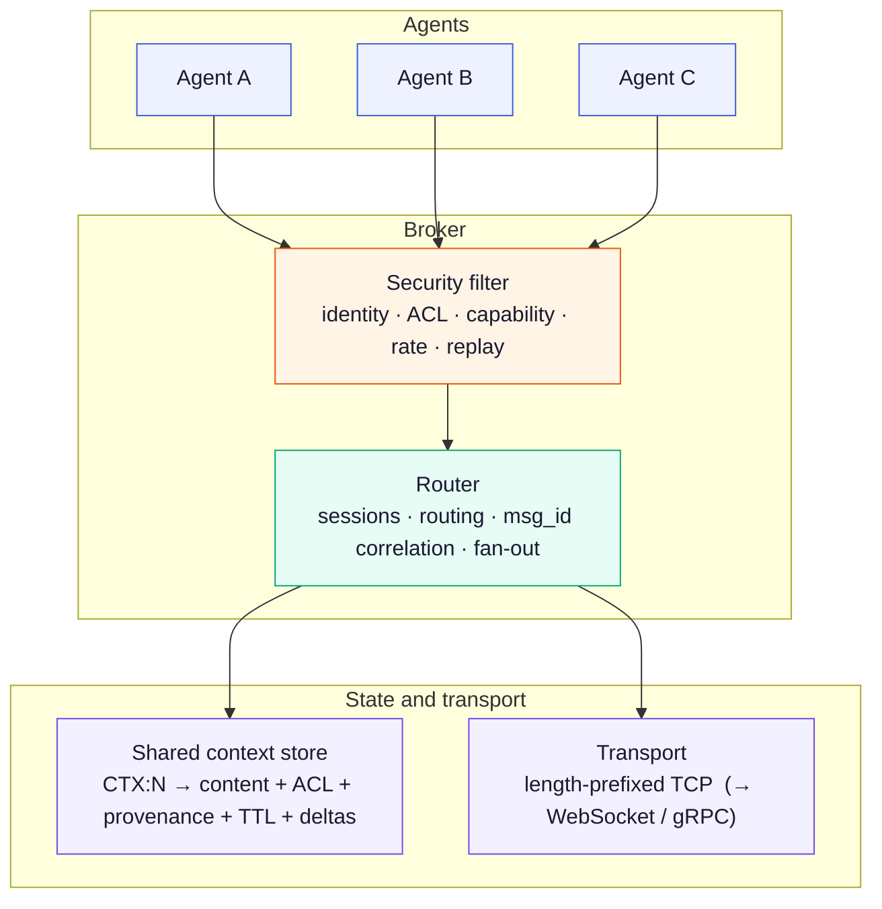

<div align="center">


</div>

<div align="center">

[](https://git.io/typing-svg)

</div>

<br/>

<div align="center">


</div>

<br/>

<div align="center">

[**Quick Start**](#quick-start) · [**Why**](#the-problem-context-re-transmission) · [**Benchmarks**](#benchmark-results) · [**Architecture**](#architecture) · [**Protocol**](#protocol--security) · [**Docs**](#documentation)

</div>

<div align="center">

**Author:** Trilochan Sharma — Independent Researcher · [@parnish007](https://github.com/parnish007)
**Paper:** [`paper/main.pdf`](paper/main.pdf) — *A Reference-Minimized, Two-Plane Architecture for Inter-Agent Messaging* · **Walkthrough:** [`docs/EXPLAINER.md`](docs/EXPLAINER.md) · **Zenodo DOI:** [10.5281/zenodo.20671083](https://zenodo.org/records/20671083)
</div>

---

## The Problem: Context Re-Transmission

In multi-agent LLM pipelines, an orchestrator hands a document to a summarizer, then a classifier, then a writer — and the **same context is re-sent on every hop**, so token cost grows with pipeline depth. There is also no structural guard on *what untrusted content is allowed to do* as it travels.

```
WITHOUT TOAP — the transcript grows at every hop
  Agent 1   doc
  Agent 2   doc + out1
  Agent 3   doc + out1 + out2
  Agent 4   doc + out1 + out2 + out3        <- token explosion

WITH TOAP — content lives once, only IDs travel
  doc  --store-->  CTX:1
  Agent 1 -> CTX:1     Agent 3 -> CTX:1
  Agent 2 -> CTX:1     Agent 4 -> CTX:1
```

**Design goal, in one line:** *Send the data once. Refer to it many times. Validate every hop.*

| | Idea | What it means |
|:--|:--|:--|
| 1 | **Reference, don't re-send** | Store content once; pass a numeric `CTX:N` instead of the bytes. |
| 2 | **Two-plane wire format** | A byte-optimized control plane for the broker; a tokenizer-aligned semantic plane for the LLM. |
| 3 | **Capability lattice** | Provenance (Internal/External/User) and allowed operations travel *with* each reference. |
| 4 | **Honest accounting** | Bytes ≠ tokens. We report both — and where TOAP loses. |

> **The honest headline:** a competent summarizing orchestrator *beats* TOAP referencing on tokens
> (~2.5× vs ~1.9×) **at equal accuracy**. TOAP earns its place through **losslessness, in-band
> security, and systematization** — not raw token savings. The paper argues this against itself
> (see [Benchmarks](#benchmark-results)). For a full top-to-bottom walkthrough, read
> [`docs/EXPLAINER.md`](docs/EXPLAINER.md).

## Quick Start

> Requires a Rust toolchain (`rustup default stable`). No API keys needed — the broker, store, and benchmarks run with no external LLM.

```bash
git clone https://github.com/parnish007/TOAP.git
cd TOAP
cargo build --workspace
cargo test  --workspace          # 29 tests pass
```

**Live fan-out demo** (4 terminals): broker, two workers, then the orchestrator —
the document is stored once and dispatched **by reference** to both workers:

```bash
cargo run -p toap-broker
cargo run -p toap-agents --bin agent_b
cargo run -p toap-agents --bin classifier
cargo run -p toap-agents --bin orchestrator
```

**Reproduce the benchmarks** (`pip install -r requirements-dev.txt`):

```bash
python benchmark/runner.py                    # wire-token comparison vs JSON baseline
python benchmark/ab_study/compute_writer.py   # multi-model A/B study (n=33)
```

**Use it as an MCP server** (exposes the context store to Claude Desktop / Cursor / VS Code):

```bash
cargo run -p toap-mcp                          # JSON-RPC over stdio: toap_set / toap_get
```

---

## What's in the Box

| Crate | Role |
|:---|:---|
| `toap-core` | V1 text + **V2 binary control-plane** codecs, parser, encoder |
| `toap-context` | Context store + `Reference` spectrum w/ fallback · ACL · **capability lattice** · TTL+GC · deltas · cache layout |
| `toap-security` | Token-bucket rate limiter · per-session replay guard · capability/taint policy |
| `toap-wire` | Length-prefixed Tokio framing |
| `toap-broker` | Async TCP server · **broker-derived identity** · ACL + capability enforcement · routing · deltas · `SUB`→`EVT` |
| `toap-client` | Async SDK — requests, events, `patch`, `subscribe` |
| `toap-agents` | `agent_a`/`agent_b` summarizer · `classifier` · `orchestrator` (fan-out + merge) |
| `toap-mcp` | Minimal MCP stdio server over the context store |

---

## Benchmark Results

All numbers below are real, reproducible from the committed run records, and reported with their
limitations. This is a single-vendor pilot (Claude family, one tokenizer) — direction-establishing,
not a general claim. Method and caveats: [`paper/main.pdf`](paper/main.pdf) · [`docs/claims.md`](docs/claims.md).

### 1. Tokens — a summarizing baseline beats TOAP, and we report it

Controlled multi-agent writer task, real Haiku/Sonnet/Opus generations, **n = 33**, scored by a
**deterministic, model-independent** rubric checker (no LLM-judge bias). Reduction is measured against
the naive "re-send the whole transcript" baseline. **All 33 samples scored 4/4 — full accuracy parity.**

```mermaid
xychart-beta
    title "Downstream token reduction vs naive  (green = summarizing baseline, blue = TOAP)"
    x-axis [Haiku, Sonnet, Opus]
    y-axis "x reduction (higher = fewer tokens)" 0 --> 3
    bar [2.39, 2.62, 2.60]
    bar [1.88, 1.93, 1.92]
```



| Model  | Naive baseline | Summarizing orchestrator | TOAP reference | Accuracy |
|:-------|:--------------:|:------------------------:|:--------------:|:--------:|
| Haiku  | 1.00×          | **2.39×**                | 1.88×          | 4/4      |
| Sonnet | 1.00×          | **2.62×**                | 1.93×          | 4/4      |
| Opus   | 1.00×          | **2.60×**                | 1.92×          | 4/4      |

The summary wins on tokens — but it is **lossy**. A TOAP reference is **lossless** (re-expandable on
demand), carries provenance/identity for security, and systematizes the behavior across agents. That
trade-off, not a token headline, is the point.

### 2. Bytes are not tokens

Symbolic opcodes look terse, but BPE tokenizers tax punctuation: **~50% byte savings collapse to
0–17% token savings.** The real win is content referencing, not encoding tricks.

```mermaid
xychart-beta
    title "Opcode vs natural language  (green = byte saving, blue = token saving)"
    x-axis [ex1, ex2, ex3, ex4]
    y-axis "% reduction vs natural language" 0 --> 60
    bar [50, 50, 38, 37]
    bar [17, 14, 0, 0]
```



### 3. Implemented vs. roadmap

| Implemented (29 tests) | Roadmap (needs a model runtime / external models) |
|:--|:--|
| V1 text + V2 binary planes | KV-cache **tensor transport** (only the `KvTransport` trait exists) |
| Context store: ACL, capability lattice, TTL, deltas, subscriptions | **Cross-vendor** real-LLM replication (GPT / Gemini / Llama) |
| Broker routing + security enforcement | Message signing / cross-reconnect replay nonces |
| Client SDK · MCP frontend · benchmarks | Durable/distributed store · WebSocket / gRPC transport |

## Scope

TOAP is a low-level **agent-to-agent** communication layer: compact operations and context IDs instead of repeatedly copying large documents or verbose natural-language instructions. It does **not** replace MCP, A2A, LangChain, AutoGen, CrewAI, or an LLM runtime — it sits below or beside them as a compact payload + routing layer. It reduces *coordination/transport* tokens; it does **not** by itself reduce a worker's own prompt tokens once a fetched context enters a model prompt (those need retrieval/summarization/caching).

## Architecture

A message travels down the stack outbound and up the stack inbound. The broker is the single
enforcement and routing point; agents never talk to each other directly.



**The two-plane idea.** Routing metadata and payload have different readers with opposite cost
functions, so TOAP separates them:

```
+----------------------------------------+
|  CONTROL PLANE   (binary)              |   read by the BROKER
|  id . session . ACL . capability . nonce|   -> optimize for BYTES
+----------------------------------------+
|  SEMANTIC PLANE  (text)                |   read by the LLM
|  OP(args)?opts . the actual content    |   -> optimize for TOKENS
+----------------------------------------+
```

Full rationale: [`docs/EXPLAINER.md`](docs/EXPLAINER.md) · [`paper/main.pdf`](paper/main.pdf) · [`docs/decisions.md`](docs/decisions.md).

<a name="protocol--security"></a>

## Protocol & Security

<details>
<summary><b>Protocol (V1 wire format)</b></summary>

<br/>

V1 uses a text frame; identity is **never** trusted from the wire (the broker derives it from the session):

```text
TYPE|MSG_ID|TARGET|PAYLOAD
```

Payloads use function-style syntax to avoid ambiguous colon parsing:

```text
SUM(CTX:42)?max_words=150&lang=en
CMP(CTX:11,CTX:22)
SET(CTX:99)?data=hello_world
OK(CTX:87)
PATCH(CTX:42)?field=status&value=approved
```

V2 adds a compact **binary** control-plane codec that round-trips the same model. Full contract → [`docs/protocol_v1.md`](docs/protocol_v1.md).

</details>

<details>
<summary><b>Security model</b></summary>

<br/>

TOAP treats all peer-agent messages as untrusted; the broker is the enforcement point.

- Agents cannot claim a trusted `SRC` field; identity is **broker-derived** from the session.
- Trust is broker-policy-derived, not self-declared.
- External/user-originated context carries a **capability-lattice** provenance; the broker refuses operations the provenance forbids (e.g. `EXEC`/`PAY`/`DELETE` on user-origin content → `ERR NOPERM reason=capability_denied`).
- Normal documents containing SQL, HTML, markdown, code, or prompt-like text are treated as **data**, not auto-rejected.
- Per-agent token-bucket **rate limiting** and per-session **replay rejection** are broker-enforced.
- Numeric performance claims must come from reproducible benchmarks.

Details → [`docs/security_model.md`](docs/security_model.md) · [`docs/decisions.md`](docs/decisions.md).

</details>

## Repository Layout

```text
.
+-- Cargo.toml            (Rust workspace)
+-- .cargo/config.toml    (windows-gnu self-contained linking)
+-- crates/
|   +-- toap-core/        (V1 text + V2 binary codecs, parser, encoder)
|   +-- toap-context/     (store: Reference spectrum, ACL, capability lattice, TTL, deltas)
|   +-- toap-security/    (rate limiter, replay guard, taint/capability policy)
|   +-- toap-wire/        (length-prefixed tokio framing)
|   +-- toap-broker/      (TCP server, sessions, routing; lib + bin + e2e tests)
|   +-- toap-client/      (async client SDK)
|   +-- toap-agents/      (agent_a, agent_b, classifier, orchestrator)
|   +-- toap-mcp/         (MCP stdio server over the context store)
+-- benchmark/            (tiktoken comparisons + multi-model A/B study + run records)
+-- paper/                (main.tex/.pdf, figures, METHODS.md)
+-- docs/                 (protocol_v1, security_model, claims, decisions)
+-- research.md, research-cot-synthesis.md   (research pass + reasoning)
```

## Documentation

| Document | Start here if… |
| --- | --- |
| [`docs/EXPLAINER.md`](docs/EXPLAINER.md) | You want a detailed, top-to-bottom plain-language walkthrough. |
| [`paper/main.pdf`](paper/main.pdf) | You want the full design, method, and honest results in one place. |
| [docs/protocol_v1.md](docs/protocol_v1.md) | You need the exact V1 frame, payload syntax, and validation rules. |
| [docs/security_model.md](docs/security_model.md) | You want identity, ACL, capability lattice, rate-limit, replay. |
| [docs/claims.md](docs/claims.md) | You want the measured-claims ledger and what is *not* claimed. |
| [docs/decisions.md](docs/decisions.md) | You want the engineering decisions and rationale. |
| [benchmark/ab_study/](benchmark/ab_study/) | You're reproducing the multi-model A/B study (run records + scorer). |
| [TEST_PLAN.md](TEST_PLAN.md) | You want the verification plan across protocol, broker, store, security. |

## Development Setup

Requires Rust stable. The repo builds on any platform with a standard toolchain
(`rustup default stable`). On a Windows host without MSVC, use the GNU toolchain:

```powershell
rustup-init.exe -y --default-host x86_64-pc-windows-gnu --profile minimal
rustup component add rust-mingw      # provides self-contained MinGW libs
```

```powershell
cargo build --workspace
cargo test --workspace          # 29 tests
```

Python benchmarks: `pip install -r requirements-dev.txt` (tiktoken + matplotlib).

## Roadmap

**Done:** V1/V2 protocol · context store (ACL, capability lattice, TTL, deltas, subscriptions) · broker
routing + security enforcement · client SDK · MCP frontend · multi-model benchmark · paper.
**Next:** KV-cache **tensor transport** (needs a model runtime) · **cross-vendor** real-LLM replication ·
message signing / cross-reconnect nonces · Redis/WebSocket backends.

## Claim Policy

No numeric savings are accepted as project facts until the benchmark suite records the result with
commit hash, hardware, tokenizer/model details, baseline, raw output, and summary table —
see [`docs/claims.md`](docs/claims.md). This README reports only measured, reproducible numbers,
including the result that a summarizing baseline beats TOAP on tokens.

## Citation

If you use TOAP in your research, please cite it (see also [`CITATION.cff`](CITATION.cff)):

```bibtex
@software{sharma_2026_toap,
  author    = {Sharma, Trilochan},
  title     = {{TOAP: The Token-Optimized Agent Protocol}},
  year      = {2026},
  publisher = {Zenodo},
  url       = {https://github.com/parnish007/TOAP}
}
```

> A Zenodo DOI will be minted on release and added here as a badge.

## License

Code is licensed under the [MIT License](LICENSE). The paper ([`paper/`](paper/)) is licensed under
[CC-BY-4.0](paper/LICENSE).

---

<div align="center">


*TOAP — store the data once, reference it many times, validate every hop.*

**Built by [Trilochan Sharma (@parnish007)](https://github.com/parnish007)**

</div>
