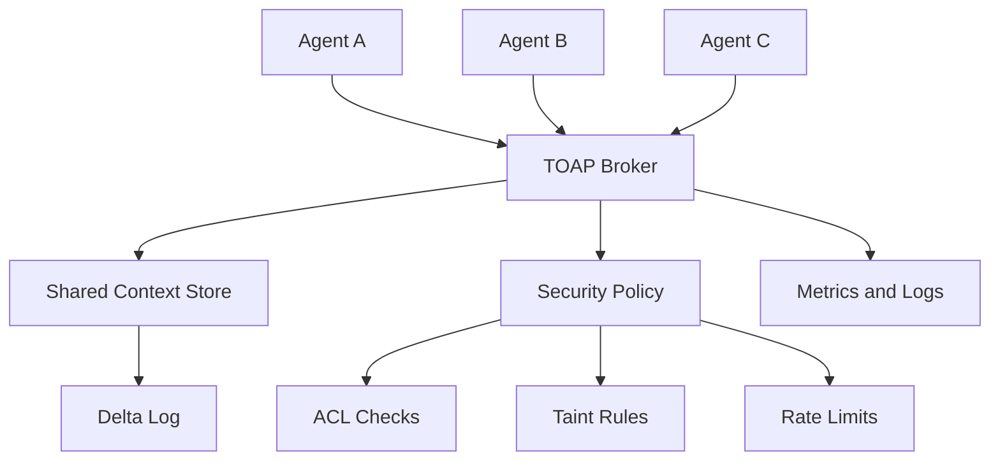

# TOAP

<div align="center">


-DEA584?style=for-the-badge&logo=rust&logoColor=white)


**Token-Optimized Agent Protocol**

Compact agent-to-agent messages, shared context references, and broker-enforced trust boundaries for multi-agent LLM systems.

[Status](#status) | [Scope](#scope) | [Architecture](#architecture) | [Protocol](#protocol-direction) | [Docs](#documentation)

</div>

## Status

TOAP is at **v1.0 (Rust)**. The stack was rewritten from the original C++ prototype following the
research pass — see the corrected design and evidence in [research.md](research.md).

What works today (**19 tests passing**, plus live multi-process demos and a token benchmark):

- `toap-core` — V1 message model, parser, encoder, round-trip + validation tests.
- `toap-context` — context store + the N3 `Reference` materialization chooser, **ACL, TTL+GC, field deltas**.
- `toap-security` — **token-bucket rate limiter, replay guard, taint policy**.
- `toap-wire` — length-prefixed tokio framing.
- `toap-broker` — tokio TCP server, SYN/ACK sessions, **broker-derived identity**, store ops with ACL,
  taint enforcement, rate-limit, replay rejection, **deltas (`DLT`) + subscriptions (`SUB`→`EVT`)**, routing.
- `toap-client` — async SDK (request/response correlation, inbound + event dispatch, `patch`/`subscribe`).
- `toap-agents` — `agent_a`/`agent_b` (summarizer), `classifier`, and an `orchestrator` (fan-out + merge).
- `toap-mcp` — minimal **MCP server** (JSON-RPC/stdio) exposing the context store as `toap_set`/`toap_get`.
- `benchmark/` — tiktoken token/byte comparison vs a JSON baseline (see [docs/claims.md](docs/claims.md)).

```powershell
# This host: no MSVC; uses the bundled self-contained MinGW (configured in .cargo/config.toml).
cargo test --workspace          # 19 tests pass
cargo build --workspace

# Live fan-out demo (4 terminals): broker, two workers, then the orchestrator
cargo run -p toap-broker
cargo run -p toap-agents --bin agent_b
cargo run -p toap-agents --bin classifier
cargo run -p toap-agents --bin orchestrator

# Token benchmark (WITH vs WITHOUT TOAP)
python benchmark/runner.py
```

Measured (synthetic, rule-based agents): **~3.3–3.8× fewer coordination tokens** with **100% accuracy
parity** (TOAP is content-lossless). The opcode layer alone is only ~10–17%; the win is context-by-ID
dedup. Honest caveats in [docs/claims.md](docs/claims.md).

### Intentionally deferred (roadmap)
V2 binary control plane (N1), KV-cache bridge (research-demoted), real-LLM accuracy study, message
signing / cross-reconnect replay nonces, Redis/WebSocket backends.

## Scope

TOAP is a low-level communication layer for multi-agent systems. Its purpose is to reduce repeated coordination overhead by letting agents send compact operations and context IDs instead of repeatedly copying large documents or verbose natural-language instructions.

TOAP focuses on:

| Area | What TOAP Provides |
| --- | --- |
| Message format | Compact, deterministic request and response payloads. |
| Context sharing | Store shared data once, then reference it as `CTX:N`. |
| Routing | Broker-mediated agent-to-agent delivery. |
| Identity | Source identity derived from broker session state. |
| Security | ACL, taint, rate-limit, and strict protocol validation. |
| Measurement | Benchmarks that separate wire bytes, protocol tokens, model input tokens, and latency. |

TOAP does **not** replace MCP, A2A, LangChain, AutoGen, CrewAI, or an LLM runtime. It can sit below or beside those systems as a compact payload and routing protocol.

## Why This Exists

Multi-agent LLM systems often resend the same context through several agents: an orchestrator sends a document to a summarizer, a classifier, a writer, and a reviewer. That increases network bytes, protocol tokens, logs, storage pressure, and security exposure.

TOAP's design goal is simple:

```text
Send the data once. Refer to it many times. Validate every hop.
```

The project is careful about claims: TOAP can reduce wire/message overhead when references replace repeated content. It does not automatically reduce total LLM inference tokens if an agent still fetches a context and places it into a model prompt. Those savings require additional strategies such as retrieval, summarization, caching, or future KV-cache work.

## Architecture



Core components planned across the build phases:

| Component | Role | Status |
| --- | --- | --- |
| `toap-core` | Parse and encode V1 text messages, later V2 binary frames. | **Implemented (V1)** |
| `toap-broker` | Sessions, routing, identity, store ops, deltas, subscriptions. | **Implemented** |
| `toap-context` | Shared data + `Reference` chooser; ACL, taint, TTL+GC, deltas. | **Implemented (in-memory)** |
| `toap-client` | Async SDK: requests, events, `patch`, `subscribe`. | **Implemented (Rust)** |
| `toap-security` | Rate limiter, replay guard, taint policy, ACL. | **Implemented** (replay is per-session; signing is roadmap) |
| `toap-mcp` | Expose the context store to MCP hosts. | **Implemented (minimal)** |
| Benchmarks | Token/byte comparison vs JSON baseline (tiktoken). | **Implemented** (synthetic; real-LLM study roadmap) |

## Protocol Direction

V1 uses a text frame:

```text
TYPE|MSG_ID|TARGET|PAYLOAD
```

Source identity is **not** trusted from the wire. The broker derives source identity from the accepted session.

Payloads use function-style syntax to avoid ambiguous colon parsing:

```text
SUM(CTX:42)?max_words=150&lang=en
CMP(CTX:11,CTX:22)
SET(CTX:99)?data=hello_world
OK(CTX:87)
PATCH(CTX:42)?field=status&value=approved
```

See [docs/protocol_v1.md](docs/protocol_v1.md) for the current protocol contract.

## Security Model

TOAP treats all peer-agent messages as untrusted. The broker is responsible for identity, routing, ACL checks, taint rules, and rate limits.

Important protocol decisions:

- Agents cannot claim a trusted `SRC` field in V1.
- Trust is broker-policy-derived, not self-declared by agents.
- External or user-originated context is tainted by default.
- Normal documents containing SQL, HTML, markdown, code, or prompt-like text are treated as data, not automatically rejected.
- Numeric performance claims must come from reproducible benchmarks.

See [docs/security_model.md](docs/security_model.md) and [docs/decisions.md](docs/decisions.md).

## Planned End Product

The target release candidate contains:

- C++ V1 and V2 protocol libraries.
- TCP broker with session-bound identity.
- Shared context store with TTL, metadata, ACL, taint, deltas, and events.
- Python SDK for agent authors.
- Example summarizer, classifier, orchestrator, and subscription agents.
- Benchmark suite with JSON, natural-language, and A2A-style JSON-RPC baselines.
- Documentation that separates implemented behavior, measured results, and roadmap research.

## Repository Layout

```text
.
+-- Cargo.toml            (workspace)
+-- .cargo/config.toml    (self-contained MinGW linking; target-dir on D:)
+-- crates/
    +-- toap-core/        (message model, parser, encoder)
    +-- toap-context/     (context store + Reference primitive)
    +-- toap-wire/        (length-prefixed tokio framing)
    +-- toap-broker/      (TCP server, sessions, routing; lib + bin + end_to_end test)
    +-- toap-client/      (async client SDK)
    +-- toap-agents/      (agent_a driver, agent_b summarizer)
+-- docs/                 (protocol_v1, security_model, claims, decisions)
+-- research.md, research-cot-synthesis.md   (research pass + reasoning)
+-- blueprint.md, phases.md                  (planning / source context)
```

## Documentation

| Document | Use It For |
| --- | --- |
| [docs/protocol_v1.md](docs/protocol_v1.md) | Exact V1 frame, payload syntax, examples, and validation rules. |
| [docs/security_model.md](docs/security_model.md) | Identity, sessions, trust, ACL, taint, injection handling, logging. |
| [docs/claims.md](docs/claims.md) | Measured claims, targets, non-claims, and publication rules. |
| [docs/decisions.md](docs/decisions.md) | Engineering decisions and rationale. |
| [TEST_PLAN.md](TEST_PLAN.md) | Verification plan for protocol, broker, store, SDK, security, and benchmarks. |

## Development Setup

Requires Rust stable. On a Windows host without MSVC, install the GNU toolchain:

```powershell
rustup-init.exe -y --default-host x86_64-pc-windows-gnu --profile minimal
rustup component add rust-mingw      # provides self-contained MinGW libs (libgcc_eh.a etc.)
```

`.cargo/config.toml` forces self-contained linking and puts build output on `D:` (C: is full on this host).

```powershell
cargo test --workspace
cargo build --workspace
```

## Roadmap

| Phase | Outcome |
| --- | --- |
| 1 | Repo foundation, corrected docs, build skeleton. |
| 2 | V1 message model, parser, and encoder. |
| 3 | TCP broker skeleton and connection-bound sessions. |
| 4 | Request and response routing. |
| 5 | Shared context store. |
| 6 | ACL, taint, and security policy. |
| 7 | Python SDK. |
| 8 | Delta updates, events, and subscriptions. |
| 9 | V2 binary encoding and negotiation. |
| 10 | Benchmarks, documentation polish, and release candidate. |

## Claim Policy

No numeric savings are accepted as project facts until the benchmark suite records the result with commit hash, hardware, tokenizer/model details, baseline, raw output, and summary table.

See [docs/claims.md](docs/claims.md).
