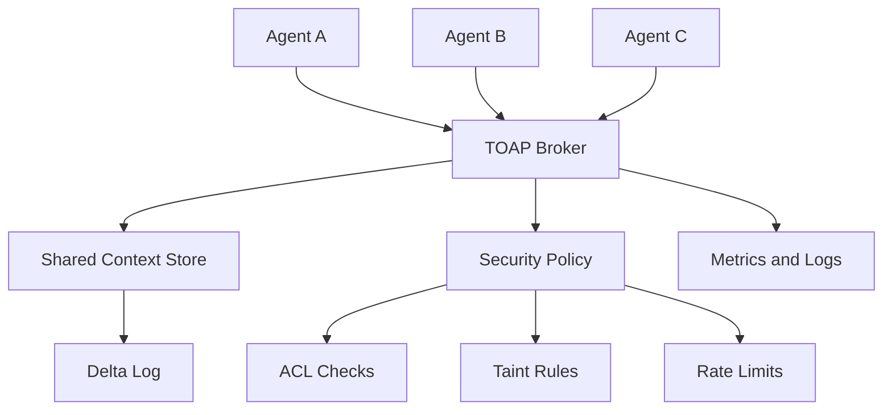

# TOAP

<div align="center">


**Token-Optimized Agent Protocol**

Compact agent-to-agent messages, shared context references, and broker-enforced trust boundaries for multi-agent LLM systems.

[Status](#status) | [Scope](#scope) | [Architecture](#architecture) | [Protocol](#protocol-direction) | [Docs](#documentation)

</div>

## Status

TOAP is currently in **phase 2: protocol core**.

The repository now includes the V1 C++ message model, payload parser, frame parser, encoder, and protocol unit tests. There is no broker, context store, SDK, or benchmark runner yet.

```bash
cmake -S . -B build
cmake --build build
ctest --test-dir build --output-on-failure
```

## Scope

TOAP is a low-level communication layer for multi-agent systems. Its purpose is to reduce repeated coordination overhead by letting agents send compact operations and context IDs instead of repeatedly copying large documents or verbose natural-language instructions.

TOAP focuses on:

| Area | What TOAP Provides |
| --- | --- |
| Message format | Compact, deterministic request and response payloads. |
| Context sharing | Store shared data once, then reference it as `CTX:N`. |
| Routing | Broker-mediated agent-to-agent delivery. |
| Identity | Source identity derived from broker session state. |
| Security | ACL, taint, rate-limit, and strict protocol validation. |
| Measurement | Benchmarks that separate wire bytes, protocol tokens, model input tokens, and latency. |

TOAP does **not** replace MCP, A2A, LangChain, AutoGen, CrewAI, or an LLM runtime. It can sit below or beside those systems as a compact payload and routing protocol.

## Why This Exists

Multi-agent LLM systems often resend the same context through several agents: an orchestrator sends a document to a summarizer, a classifier, a writer, and a reviewer. That increases network bytes, protocol tokens, logs, storage pressure, and security exposure.

TOAP's design goal is simple:

```text
Send the data once. Refer to it many times. Validate every hop.
```

The project is careful about claims: TOAP can reduce wire/message overhead when references replace repeated content. It does not automatically reduce total LLM inference tokens if an agent still fetches a context and places it into a model prompt. Those savings require additional strategies such as retrieval, summarization, caching, or future KV-cache work.

## Architecture



Core components planned across the build phases:

| Component | Role | Status |
| --- | --- | --- |
| Protocol core | Parse and encode V1 text messages, later V2 binary frames. | V1 implemented |
| Broker | Own sessions, route messages, enforce identity. | Planned |
| Context store | Persist shared data, metadata, TTL, ACL, and deltas. | Planned |
| Security layer | Validate frames, enforce ACL and taint policy. | Planned |
| Python SDK | Let agents use TOAP without manual wire formatting. | Planned |
| Benchmarks | Prove or reject target savings with reproducible runs. | Planned |

## Protocol Direction

V1 uses a text frame:

```text
TYPE|MSG_ID|TARGET|PAYLOAD
```

Source identity is **not** trusted from the wire. The broker derives source identity from the accepted session.

Payloads use function-style syntax to avoid ambiguous colon parsing:

```text
SUM(CTX:42)?max_words=150&lang=en
CMP(CTX:11,CTX:22)
SET(CTX:99)?data=hello_world
OK(CTX:87)
PATCH(CTX:42)?field=status&value=approved
```

See [docs/protocol_v1.md](docs/protocol_v1.md) for the current protocol contract.

## Security Model

TOAP treats all peer-agent messages as untrusted. The broker is responsible for identity, routing, ACL checks, taint rules, and rate limits.

Important protocol decisions:

- Agents cannot claim a trusted `SRC` field in V1.
- Trust is broker-policy-derived, not self-declared by agents.
- External or user-originated context is tainted by default.
- Normal documents containing SQL, HTML, markdown, code, or prompt-like text are treated as data, not automatically rejected.
- Numeric performance claims must come from reproducible benchmarks.

See [docs/security_model.md](docs/security_model.md) and [docs/decisions.md](docs/decisions.md).

## Planned End Product

The target release candidate contains:

- C++ V1 and V2 protocol libraries.
- TCP broker with session-bound identity.
- Shared context store with TTL, metadata, ACL, taint, deltas, and events.
- Python SDK for agent authors.
- Example summarizer, classifier, orchestrator, and subscription agents.
- Benchmark suite with JSON, natural-language, and A2A-style JSON-RPC baselines.
- Documentation that separates implemented behavior, measured results, and roadmap research.

## Repository Layout

```text
.
+-- CMakeLists.txt
+-- README.md
+-- TEST_PLAN.md
+-- requirements-dev.txt
+-- protocol/
    +-- encoder.cpp
    +-- parser.cpp
    +-- include/toap/
    +-- tests/
+-- docs/
    +-- claims.md
    +-- decisions.md
    +-- protocol_v1.md
    +-- security_model.md
```

`blueprint.md` and `phases.md` are intentionally ignored. They are planning/source-context files, not versioned project docs.

## Documentation

| Document | Use It For |
| --- | --- |
| [docs/protocol_v1.md](docs/protocol_v1.md) | Exact V1 frame, payload syntax, examples, and validation rules. |
| [docs/security_model.md](docs/security_model.md) | Identity, sessions, trust, ACL, taint, injection handling, logging. |
| [docs/claims.md](docs/claims.md) | Measured claims, targets, non-claims, and publication rules. |
| [docs/decisions.md](docs/decisions.md) | Engineering decisions and rationale. |
| [TEST_PLAN.md](TEST_PLAN.md) | Verification plan for protocol, broker, store, SDK, security, and benchmarks. |

## Development Setup

Configure the C++ project:

```bash
cmake -S . -B build
cmake --build build
ctest --test-dir build --output-on-failure
```

Install future Python development dependencies:

```bash
python -m pip install -r requirements-dev.txt
```

No broker runtime command exists yet. Phase 2 only builds and tests the protocol library.

## Roadmap

| Phase | Outcome |
| --- | --- |
| 1 | Repo foundation, corrected docs, build skeleton. |
| 2 | V1 message model, parser, and encoder. |
| 3 | TCP broker skeleton and connection-bound sessions. |
| 4 | Request and response routing. |
| 5 | Shared context store. |
| 6 | ACL, taint, and security policy. |
| 7 | Python SDK. |
| 8 | Delta updates, events, and subscriptions. |
| 9 | V2 binary encoding and negotiation. |
| 10 | Benchmarks, documentation polish, and release candidate. |

## Claim Policy

No numeric savings are accepted as project facts until the benchmark suite records the result with commit hash, hardware, tokenizer/model details, baseline, raw output, and summary table.

See [docs/claims.md](docs/claims.md).
