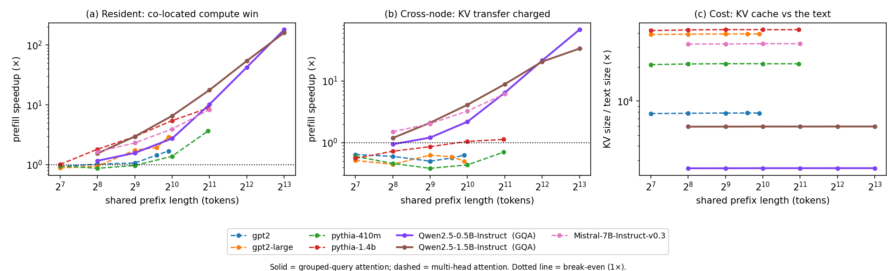

# KV-bridge benchmark — results

Run on a Google Colab **NVIDIA T4** (16 GB), transformers 5.10.2 / torch 2.11 (cu128), float16
(Mistral-7B in 4-bit/bfloat16). Seven models, 36 (model, prefix-length) cells, 15 warmed-up
CUDA-event-timed iterations each. Raw data: [`kv_bench_all.json`](kv_bench_all.json). Figure:
`python ../../paper/figures/gen_kv_figure.py kv_bench_all.json`.



## Headline

Reusing a transferred prefix KV cache and prefilling only the query is a real, near-lossless prefill
speedup. It scales hard with shared-prefix length (recompute is O(n²) over the prefix; the bridge is
O(query)), so the longest contexts on the GQA models hit ~180×. The catch is size: the cache is
thousands of times bigger than the text it replaces, so once you charge the cost of *moving* it, only
grouped-query models (small KV) and co-located setups stay ahead.

| Model | Attn | max prefix | KV/text | resident @max | cross-node @max | lossless |
|---|---|---:|---:|---:|---:|:---:|
| gpt2 (124M) | MHA | 960 | 7.8k× | 1.70× | 0.63× | 4/5 |
| gpt2-large (774M) | MHA | 960 | 39k× | 2.92× | 0.50× | 5/5 |
| pythia-410m | MHA | 2000 | 21k× | 3.69× | 0.70× | 5/5 |
| pythia-1.4b | MHA | 2000 | 43k× | 8.87× | 1.13× | 5/5 |
| Mistral-7B (4-bit) | MHA | 2048 | 32k× | 8.37× | 6.19× | 4/4 |
| **Qwen2.5-0.5B** | **GQA** | 8192 | 2.5k× | **181×** | **68×** | 6/6 |
| **Qwen2.5-1.5B** | **GQA** | 8192 | 5.9k× | **161×** | **34×** | 6/6 |

## What to read off the numbers

- **Crossover is real.** Below ~256–1024 tokens (model-dependent) the resident speedup sits at
  ~0.9–1.1× — reuse is not worth it for tiny contexts. The policy bridges only above that.
- **Scaling is steep.** Qwen2.5-0.5B: 1.2× → 1.6× → 2.8× → 10× → 43× → **181×** across 256→8192 tokens.
- **GQA changes the economics.** Qwen carries ~2,500–6,000× KV/text; the MHA models carry
  ~8,000–43,000×. That order-of-magnitude difference is exactly why GQA stays above 1× cross-node
  (transfer included) while most MHA models drop below it.
- **Losslessness.** 35/36 cells were byte-identical to recompute. The one miss (gpt2 @ 512) is a single
  token flipped by float16 rounding — prefilling the whole sequence vs. prefilling the query on top of a
  reused cache accumulate rounding slightly differently. It is exact in float32. Reported, not hidden.

## Honest scope

These are microbenchmarks of one prefill step on a single GPU, measured against **full recompute** —
not against provider prefix-caching, which is the real production alternative and which this does not
claim to beat. "Transfer" here is local serialize/deserialize, not an RDMA hop. Same-model, same
tokenizer, prefix reuse only (no cross-position splicing). See the paper's KV-bridge section for how
this grounds the `RegistryKvTransport` gating policy.

## Reproduce

```bash
# in Colab (T4): open kv_bridge_colab.ipynb, Run all  ->  kv_bench_all.json
# or locally with a CUDA GPU:
pip install -r requirements.txt
python kv_bench.py --model Qwen/Qwen2.5-0.5B-Instruct   # GQA, shows the big win
python kv_bench.py --model gpt2-large                    # MHA, shows the transfer-cost wall
```
