# TOAP, Explained — Top to Bottom

A plain-language walkthrough of what TOAP is, how every layer works, and — just as
importantly — where it wins, where it loses, and why. Read this if you want to *understand* the
system before the paper or the code.

> **One-line summary:** TOAP is a state-management protocol for multi-agent LLM systems built on one
> idea — *store content once, pass references everywhere* — with a two-plane wire format, a
> reference-materialization spectrum, and capability-lattice security attached to every context.

---

## 1. The Big Picture

Multi-agent pipelines have a quiet, expensive habit: they re-send the same context on every hop.

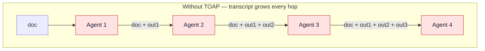

Token cost grows with pipeline depth — a *token explosion*. With TOAP, the content lives once in a
shared store and only **IDs** travel:

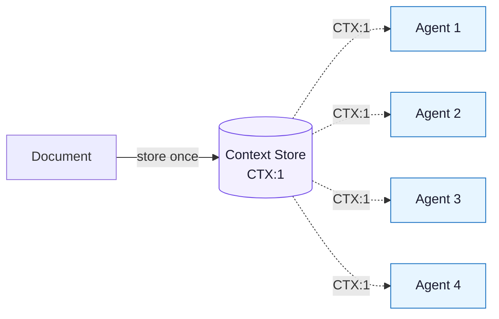

That is the whole intuition. Everything else in TOAP exists to make that idea **safe**,
**lossless**, and **practical** across many heterogeneous agents.

### The honest framing (read this before the hype)

TOAP's own experiments show that a *competent summarizing orchestrator* beats reference-passing on
raw token count (~2.5× vs ~1.9× vs a naive baseline), at equal task accuracy. So TOAP is **not**
primarily a token-saving trick. Its real value is what a summary throws away:

- **Losslessness** — a reference can be re-expanded to the full original content on demand; a
  summary is lossy and a dropped detail is gone forever.
- **Security/provenance** — identity, taint, and capability constraints travel *with* the reference.
- **Systematization** — the behavior is uniform across agents/languages instead of being
  re-implemented as a prompt template in each app.

Think "operating-system-style messaging layer for agents," not "another prompt-compression hack."

---

## 2. The Layer Stack

TOAP is layered. A message travels down the stack on the way out and up the stack on the way in.

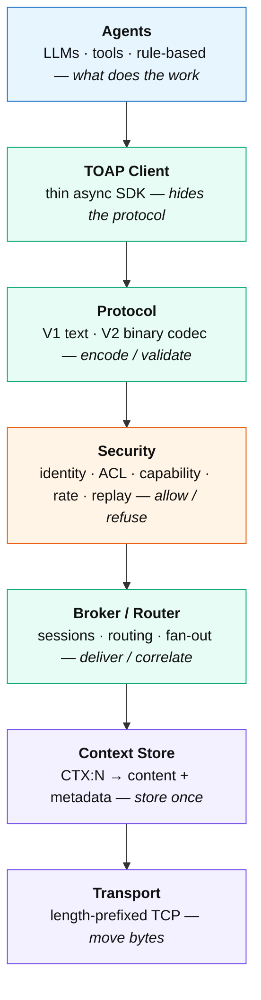

Each layer is explained below, with what it does, the relevant code, and its trade-offs.

---

## 3. Layer 1 — Agents

At the top are the agents. They can be LLMs, rule-based workers, tools, or MCP-connected agents.
**The key rule: agents never talk to each other directly.** Everything goes through the broker —
this is what makes identity un-spoofable (Layer 4) and routing uniform (Layer 5).

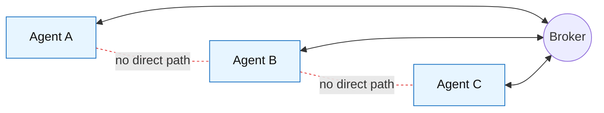

In the repo the demo agents are in `crates/toap-agents`: `agent_b` (summarizer, `SUM`), `classifier`
(rule-based, `CLS`), and `orchestrator` (stores a document once, fans it out by reference).

| Pros | Cons |
|---|---|
| Agents stay simple — no transport, retries, or identity to manage | The broker is a central dependency: if it's down, nobody talks (see Layer 5 cons) |

---

## 4. Layer 2 — TOAP Client (the SDK)

Each agent uses a small async SDK so it never hand-writes wire bytes.

```rust
let client = Client::connect("127.0.0.1:7700", "agentA", "SUM,GEN").await?;
let cid     = client.set_context("the document text", /*tainted=*/true).await?;
let reply   = client.send_request("agentB", Payload::new("SUM").arg_ctx(cid)).await?;
let summary = client.get_context(reply.payload.first_ctx().unwrap()).await?;
client.subscribe(cid).await?;                  // get EVT notifications on changes
```

The client (`crates/toap-client`) performs the SYN/ACK handshake that binds identity to the
connection, correlates each reply to its request by `msg_id`, and separates inbound **events**
(`recv_event`) from inbound **requests** (`recv`).

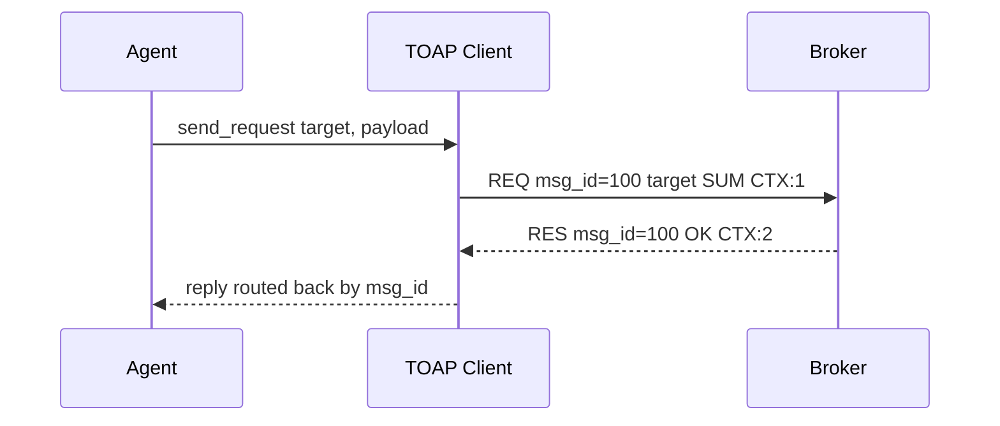

| Pros | Cons |
|---|---|
| Agent code is a handful of calls; protocol is invisible | Only a Rust SDK today — other languages must speak the (simple, text) wire format directly |

---

## 5. Layer 3 — Protocol Layer

Where a message becomes bytes (and back): validation, serialization, parsing, encoding. TOAP has two
wire versions.

### V1 — text

Human-readable, easy to debug. Four pipe-separated fields, function-style payload:

```text
TYPE | MSG_ID | TARGET | PAYLOAD

REQ|100|agentB|SUM(CTX:42)?max_words=150&lang=en
RES|100|agentA|OK(CTX:87)
DLT|101|broker|PATCH(CTX:42)?field=status&value=approved
```

Why function-style? Because `SUM:CTX:42` is ambiguous — `CTX:42` already contains a colon.
`OP(args)?key=value` makes positional args and options unambiguous. The parser (`crates/toap-core`)
is **strict about protocol grammar** but **never rejects ordinary content** — SQL, HTML, code, and
even "ignore previous instructions" are valid *data*.

### V2 — binary control plane

A compact binary header for the control fields, with the semantic payload kept as text. It
round-trips the same message model (`crates/toap-core/src/v2.rs`):

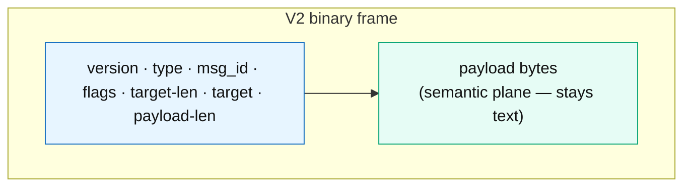

| Pros | Cons |
|---|---|
| V1 text is trivial to inspect/log; V2 binary shrinks control overhead and enables the two-plane design | Two formats to maintain; V2 negotiation/upgrade isn't yet a full handshake feature |

---

## 6. Layer 4 — Security Filter

Before a message is routed, it passes a filter that asks four questions. (Code: `crates/toap-security`
+ enforcement in `crates/toap-broker`.)

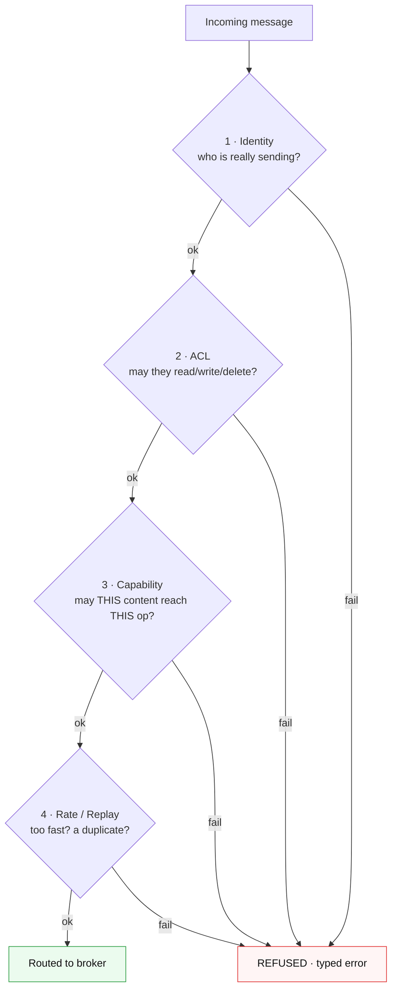

### 4.1 Identity — broker-derived, never claimed
The wire frame has **no `SRC` field**. The broker binds one `agent_id` to the connection at SYN and
uses that for routing, ACL, logs, and rate limits. A responder replies to the original `msg_id`, so it
never even learns who asked. This structurally defeats source-spoofing.

### 4.2 ACL — per-context read/write/delete
Each context carries an access list, e.g. `agentA:rwd , agentB:r , *:r`. The owner always has full
access; an unauthorized read returns `NOPERM`, not the data.

### 4.3 Capability lattice — the structural injection guard
Content has an **origin** and a set of **capabilities** it may flow into:

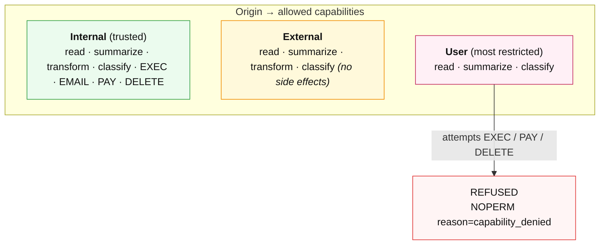

The broker maps each opcode to a capability (`Capability::for_op`) and refuses anything the content's
provenance forbids. So if a malicious document literally says "delete the database," that *content* is
structurally blocked from reaching a destructive operation — and because the tag travels with the
reference, taint is preserved across hops (containing prompt-injection propagation).

### 4.4 Rate limit & replay
A per-agent token bucket (`ERR RATE`) and per-session duplicate-`msg_id` rejection (`ERR REPLAY`).

| Pros | Cons |
|---|---|
| Identity un-spoofable; injection contained *structurally*, not by keyword bans; DoS + naive replay handled | Replay is **per-session only** (no cross-reconnect nonces yet); no message **signing** yet (needs TLS/mTLS underneath); lattice is coarse (3 origins) |

---

## 7. Layer 5 — Broker / Router

The broker is TOAP's brain. Every message flows through it.

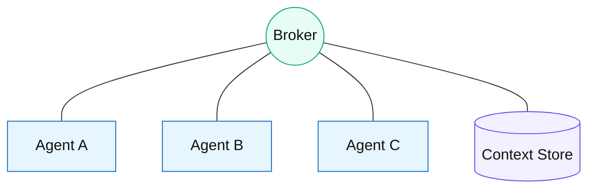

Responsibilities: **routing** (deliver `REQ` to the target), **correlation** (match `RES`/`ERR` to the
requester by `msg_id`), **sessions** (one record per connection), **fan-out**, and **replay
protection**. A `PATCH` to a subscribed context pushes an `EVT` to every subscriber:

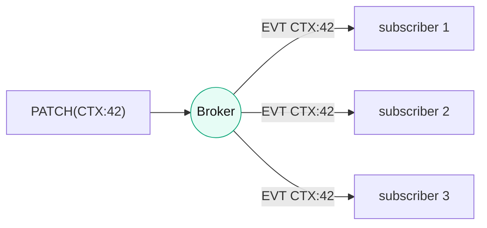

| Pros | Cons |
|---|---|
| Uniform enforcement point; subscriptions make state changes push-based | **Single point of failure & chokepoint** (explicit threat-model assumption); HA/failover not yet built; throughput ceiling |

---

## 8. Layer 6 — Shared Context Store

The heart of TOAP. Content is stored once and addressed by a numeric ID. Each entry carries far more
than bytes:

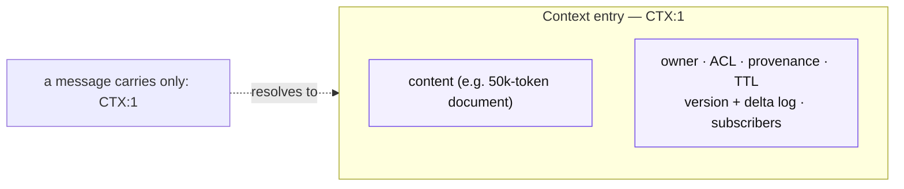

Instead of sending 50k tokens, you send `CTX:1`. The metadata is what makes a reference **lossless**
(content recoverable), **secure** (provenance travels), and **collaborative** (versioned deltas +
events). Code: `crates/toap-context`.

| Pros | Cons |
|---|---|
| Dedup across the whole mesh (what provider prompt-caching can't do cross-agent/provider); metadata travels with content; deltas + versioning enable collaboration & inspection | Backend is **in-memory, single-node** — doesn't survive restart, doesn't scale horizontally (durable/distributed backends are roadmap) |

---

## 9. The Clever Part — Two-Plane Design

Most protocols mix routing metadata and payload into one blob. TOAP notices the two have **different
readers with opposite cost functions** and splits them:

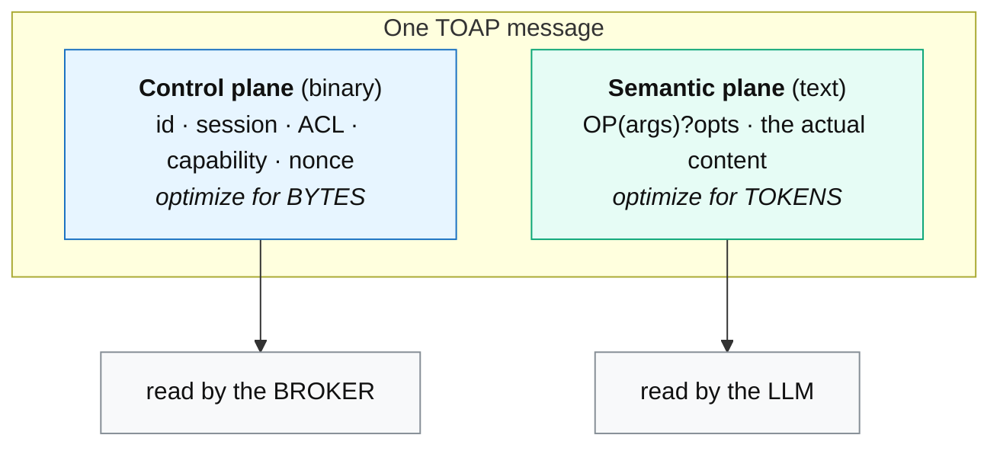

The broker mostly reads the control plane and never tokenizes the payload; the LLM mostly reads the
semantic plane and never sees the control header. Encoding each plane for its single reader means
neither is dominated — which is why "bytes vs tokens" stops being a confusion.

| Pros | Cons |
|---|---|
| Clean separation; control plane can go compact/binary while semantic plane stays tokenizer-friendly | More moving parts than one JSON blob; full benefit needs V2 binary as the default transport (today V1 text is common) |

---

## 10. The Most Research-Worthy Idea — Reference Materialization Spectrum

A reference is one *logical* thing with three *physical* materializations, chosen per call by a cost
model, with **graceful fallback**:

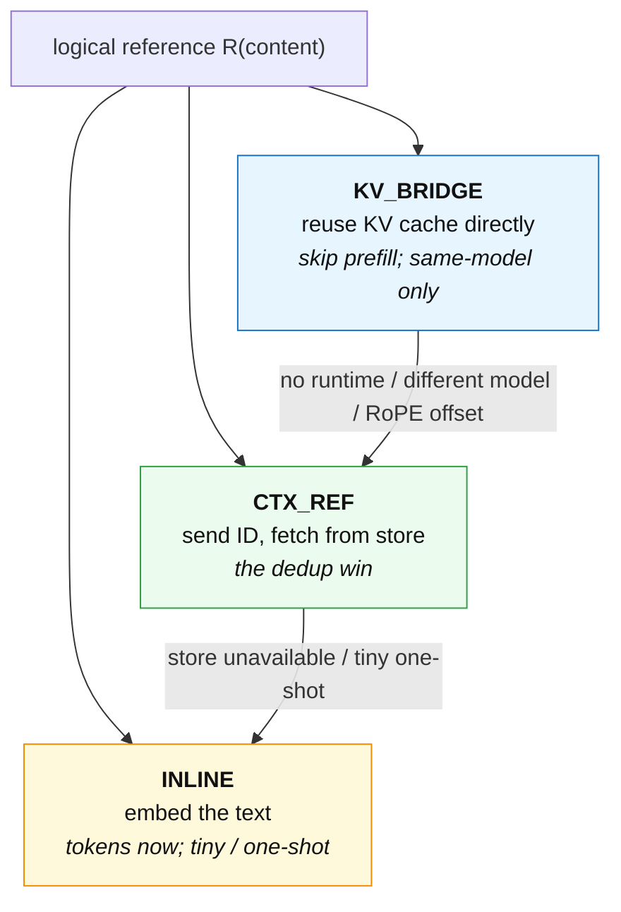

The cost model weighs content length, reference frequency, link bandwidth, GPU load, and the
same-model constraint. The same decision — *materialize now vs reference vs reuse computation* —
spans the **token plane** (resend vs ID) and the **tensor plane** (re-prefill vs load KV). Treating
them as one policy is the architecture's most novel point.

| Pros | Cons |
|---|---|
| One decision across token + tensor planes; fallback chain means a reference is never a hard dependency | **KV_BRIDGE tensor transport is not implemented** — only the `KvTransport` trait/policy exists; KV reuse is genuinely hard (RoPE offsets, attention loss) and a KV cache is far larger than the text, so it often loses to "re-send text + prefix cache" |

---

## 11. How a Request Flows (end to end)

Task: *summarize a document, then act on the summary.*

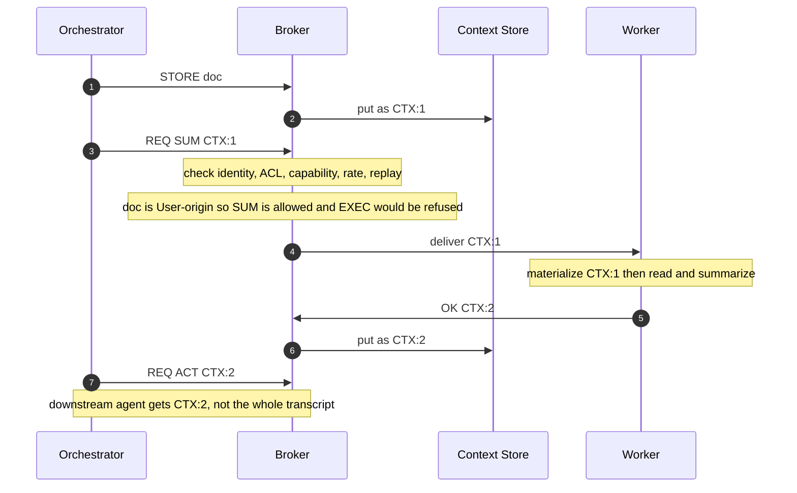

---

## 12. Architecture in One Diagram

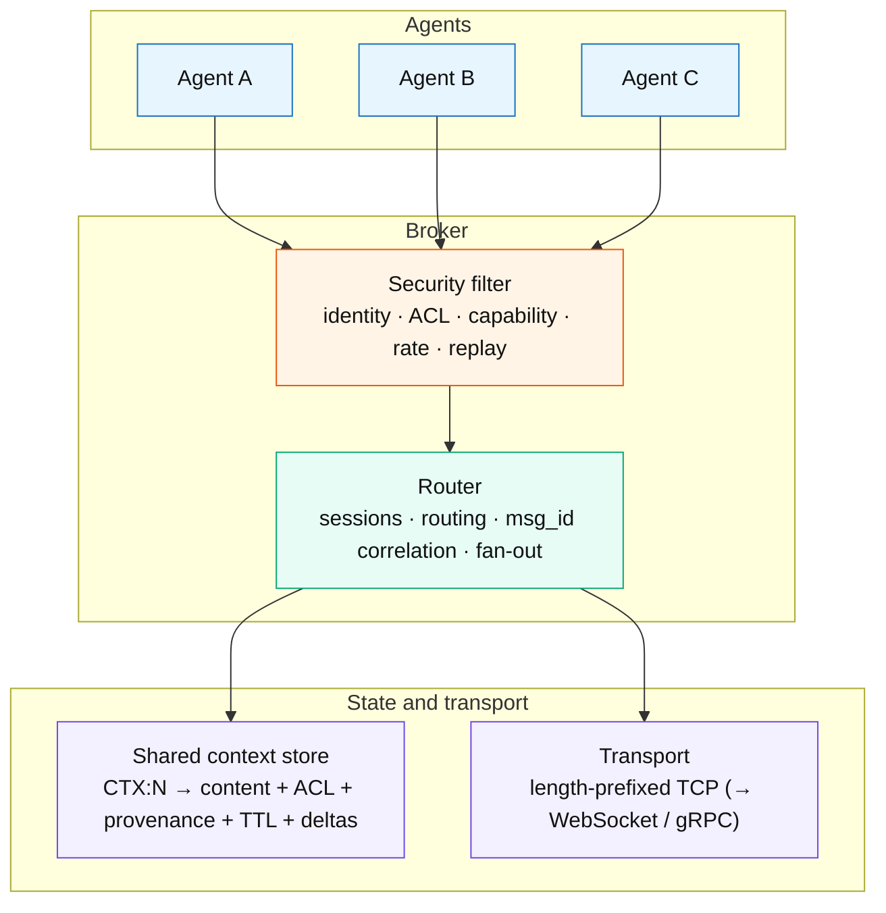

---

## 13. Honest Pros and Cons — the Whole System

### Where TOAP genuinely wins
- **Lossless references** beat lossy summaries when a later step needs a detail a summary dropped.
- **Security travels with data** — broker-derived identity + capability lattice contain spoofing and
  injection propagation structurally, which a prompt template cannot.
- **Cross-agent / cross-provider dedup** — provider caching only helps a stable prefix within one
  provider/session; TOAP dedups across the whole mesh.
- **Systematized multi-agent state** — versioning, deltas, subscriptions, TTL, ACL in one place.

### Where TOAP does not win (and the paper says so)
- **Raw tokens:** a competent summarizing orchestrator is *more* token-efficient (~2.5× vs ~1.9×).
- **Symbolic opcodes:** terse syntax saves ~50% of *bytes* but only 0–17% of *tokens* (BPE taxes
  punctuation). The win is content referencing, not opcode terseness.
- **Single agent reading one doc once:** referencing saves nothing — the agent still reads the doc.

### Current implementation limitations (roadmap)

| Limitation | Status |
|---|---|
| Context store is in-memory, single-node | durable/distributed backend is roadmap |
| Broker is a single point of failure | HA/failover not implemented |
| KV-bridge tensor transport | only the policy/trait exists; needs a model runtime |
| Message signing / cross-reconnect replay nonces | not yet (per-session replay only) |
| Cross-vendor token claims | only the Claude family/one tokenizer measured so far |
| Client SDKs | Rust only today |

### Evidence honesty
The benchmark is a real but **single-vendor, small-n pilot** (Claude Haiku/Sonnet/Opus, n=33,
deterministic bias-free scoring). It establishes direction and *disproves* the naive "references save
the most tokens" claim; it is **not** a general efficiency claim. See `docs/claims.md` and the paper.

---

## 14. The One-Paragraph Takeaway

TOAP is best understood as an **operating-system-style messaging layer for LLM agents**, not another
agent framework and not a token-compression gimmick. Its three ideas worth attention are the
**two-plane architecture** (separate byte and token planes for separate readers), the **reference
materialization spectrum** (INLINE → CTX_REF → KV_BRIDGE with graceful fallback, spanning the token
and tensor planes), and **capability-lattice security attached to context** (provenance and
allowed-operations travel with every reference). "CTX references" themselves are old (blackboard
systems, the 1980s); the contribution is the combination, the honest measurement, and a working,
tested implementation.

---

*See also: [`paper/main.pdf`](../paper/main.pdf) · [`docs/protocol_v1.md`](protocol_v1.md) ·
[`docs/security_model.md`](security_model.md) · [`docs/decisions.md`](decisions.md) ·
[`docs/claims.md`](claims.md).*
