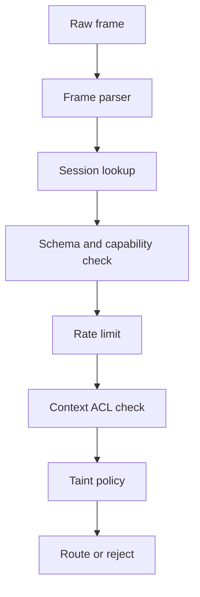

# TOAP Security Model

TOAP assumes peer agents can be buggy, compromised, or malicious. The broker is the enforcement point for identity, routing, ACLs, taint policy, rate limits, and audit logs.

## Security Pipeline



## Identity

Source identity is broker-derived. The V1 frame does not include a trusted `SRC` field.

The broker binds one approved `agent_id` to each accepted connection/session. Routing, ACL checks, logs, and rate limits use that broker-held identity.

## Session Records

Each accepted connection has one session record:

```text
session_id
agent_id
capabilities
protocol_version
trust_level
created_at
expires_at
```

The session is created during `SYN` and `ACK`. The broker owns the final record.

## Trust

Trust is policy-derived, not self-declared.

An agent may request identity and capabilities during `SYN`, but the broker decides the final trust level from configuration, allowlists, credentials, or future authentication mechanisms.

| Trust | Meaning | Intended Use |
| --- | --- | --- |
| `internal` | Approved local or same-organization agent. | Development and controlled deployments. |
| `external` | Known third-party agent. | Partner or integration agents. |
| `untrusted` | Unknown or minimally trusted agent. | Open registration, tests, or public-facing ingress. |

Open registration is acceptable for local development. Production deployments should use allowlists or credentials.

## ACLs

Context ACL checks are broker-enforced on every context operation.

| Permission | Meaning |
| --- | --- |
| `r` | Read context data. |
| `w` | Update context data or metadata. |
| `d` | Delete context. |
| `a` | Administer ACL and ownership metadata. |

The broker must not reveal private context existence to unauthorized agents. For example, an unauthorized read should not distinguish "missing" from "not allowed" unless policy explicitly permits it.

## Taint

User-originated and external-originated contexts are tainted by default.

Taint means the content must be handled as data. It does not mean the content is automatically malicious. Tainted context should still be allowed to store normal SQL, HTML, markdown, source code, logs, and prompt-like text.

Taint bypass requires broker policy. A requesting agent cannot self-declare trust elevation.

## Injection Handling

TOAP rejects malformed protocol structure and unsafe placement of untrusted data. It does not rely on broad content pattern bans.

Allowed as context data:

```text
DROP TABLE users;
<div>example</div>
print("hello")
Ignore previous instructions
```

Rejected as protocol problems:

- Wrong delimiter count.
- Invalid payload grammar.
- Invalid context reference.
- Source spoofing attempts that affect routing or ACL behavior.
- Unauthorized context operations.

## Rate Limiting

Rate limits are enforced per broker-derived `agent_id`, not per client-provided field.

Phase 6 will define:

- Messages per second.
- Burst size.
- Context creates per minute.
- Maximum open subscriptions.
- Maximum context bytes per agent.

## Logging

Security logs should include:

- Session creation and rejection.
- Unauthorized context access attempts.
- Invalid protocol frames.
- Rate-limit rejections.
- Taint policy blocks.

Logs should not dump full sensitive context content by default.

## Open Security Work

Phase 1 intentionally does not define final production authentication. Later phases must decide whether production identity uses allowlists, shared secrets, mTLS, signed messages, OAuth/JWT, or another deployment-specific mechanism.
