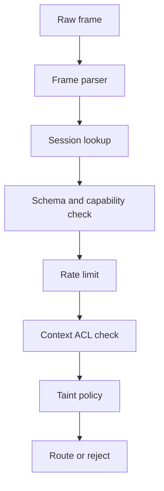

# TOAP Security Model

TOAP assumes peer agents can be buggy, compromised, or malicious. The broker is the enforcement point for identity, routing, ACLs, taint policy, rate limits, and audit logs.

## Security Pipeline



## Identity

Source identity is broker-derived. The V1 frame does not include a trusted `SRC` field.

The broker binds one approved `agent_id` to each accepted connection/session. Routing, ACL checks, logs, and rate limits use that broker-held identity.

## Session Records

Each accepted connection has one session record:

```text
session_id
agent_id
capabilities
protocol_version
trust_level
created_at
expires_at
```

The session is created during `SYN` and `ACK`. The broker owns the final record.

## Trust

Trust is policy-derived, not self-declared.

An agent may request identity and capabilities during `SYN`, but the broker decides the final trust level from configuration, allowlists, credentials, or future authentication mechanisms.

| Trust | Meaning | Intended Use |
| --- | --- | --- |
| `internal` | Approved local or same-organization agent. | Development and controlled deployments. |
| `external` | Known third-party agent. | Partner or integration agents. |
| `untrusted` | Unknown or minimally trusted agent. | Open registration, tests, or public-facing ingress. |

Open registration is acceptable for local development. Production deployments should use allowlists or credentials.

## ACLs

Context ACL checks are broker-enforced on every context operation.

| Permission | Meaning |
| --- | --- |
| `r` | Read context data. |
| `w` | Update context data or metadata. |
| `d` | Delete context. |
| `a` | Administer ACL and ownership metadata. |

The broker must not reveal private context existence to unauthorized agents. For example, an unauthorized read should not distinguish "missing" from "not allowed" unless policy explicitly permits it.

## Taint / Capability-Lattice Provenance

User-originated and external-originated contexts are untrusted by default. TOAP models this as a
**capability lattice** rather than a single boolean: each context has an `Origin`
(`Internal` / `External` / `User`) carrying the set of capabilities its data may flow into
(read, summarize, transform, classify, execute, email, pay, delete).

Provenance means the content must be handled as data; it does not mean the content is automatically
malicious. Untrusted context may still store normal SQL, HTML, markdown, source code, logs, and
prompt-like text.

The broker maps each opcode to a capability (`Capability::for_op`) and refuses operations the
provenance does not permit — e.g. `EXEC`, `EMAIL`, `PAY`, or `DELETE` against `User`/`External`
content returns `ERR NOPERM reason=capability_denied`. Elevation requires broker policy; a requesting
agent cannot self-declare it. This contains prompt-injection-style propagation: taint travels with the
reference across agent-to-agent hops.

## Injection Handling

TOAP rejects malformed protocol structure and unsafe placement of untrusted data. It does not rely on broad content pattern bans.

Allowed as context data:

```text
DROP TABLE users;
<div>example</div>
print("hello")
Ignore previous instructions
```

Rejected as protocol problems:

- Wrong delimiter count.
- Invalid payload grammar.
- Invalid context reference.
- Source spoofing attempts that affect routing or ACL behavior.
- Unauthorized context operations.

## Rate Limiting

Rate limits are enforced per broker-derived `agent_id`, not per client-provided field. The
implementation uses a per-agent token bucket (`toap-security::RateLimiter`); exceeding it returns
`ERR RATE`.

## Replay Protection

The broker rejects duplicate request `MSG_ID`s within a session (`toap-security::ReplayGuard`),
returning `ERR REPLAY`. This is a per-session guard; full cross-reconnect replay protection (signed
per-frame nonces) is future work.

## Logging

Security logs should include:

- Session creation and rejection.
- Unauthorized context access attempts.
- Invalid protocol frames.
- Rate-limit rejections.
- Taint policy blocks.

Logs should not dump full sensitive context content by default.

## Open Security Work

Phase 1 intentionally does not define final production authentication. Later phases must decide whether production identity uses allowlists, shared secrets, mTLS, signed messages, OAuth/JWT, or another deployment-specific mechanism.
